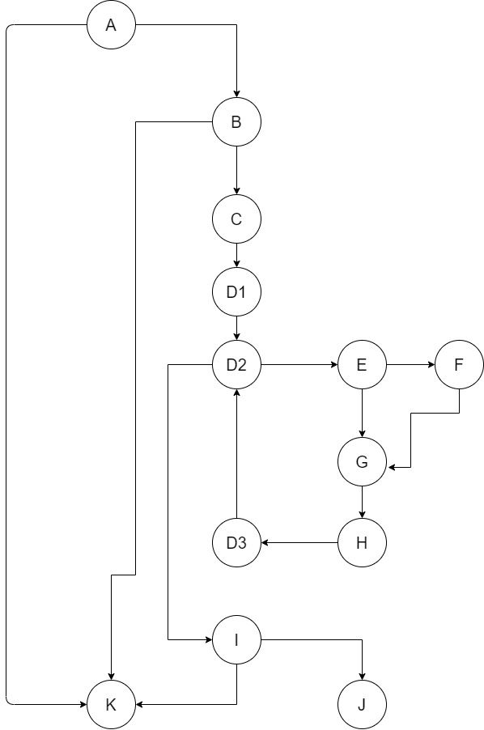
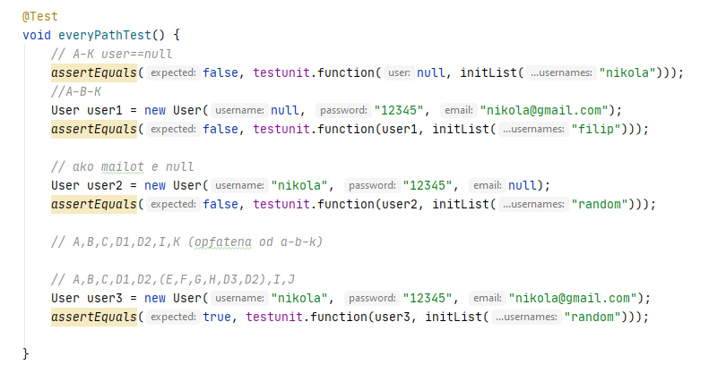
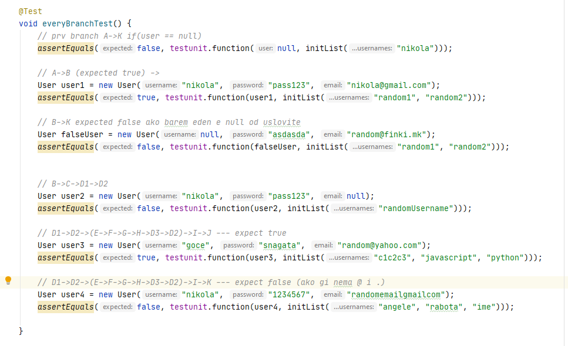

# Софтверско инженерство Лабораториска вежба 2
# Никола Трпчевски бр.индекс 172045
# Група на код:
Ја добив групата 1

# Control flow diagram

# Цикломатска комплексност
Цикломатската комплексност е 5. Ја добив преку формулата E-V+2, каде Е е бројот на јазли, а V е бројот на темиња односно 16-13+2

# Тест случаи според Every Path

# Тест случаи според Every Branch

# Објаснување на тестовите

