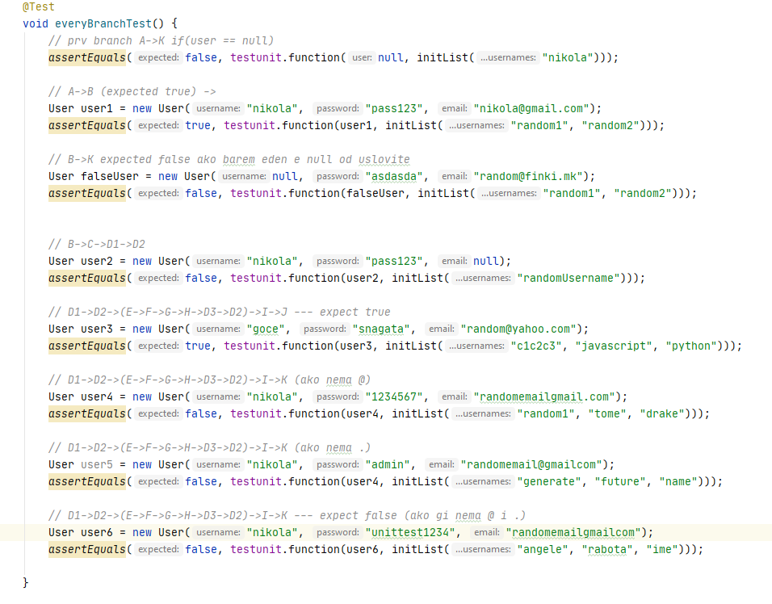

# Софтверско инженерство Лабораториска вежба 2
## Никола Трпчевски бр.индекс 172045
### Група на код:
Ја добив групата 1

### Control flow diagram

### Цикломатска комплексност
Цикломатската комплексност е 5. Ја добив преку формулата E-V+2, каде Е е бројот на јазли, а V е бројот на темиња односно 16-13+2

### Тест случаи според Every Path

### Тест случаи според Every Branch

### Објаснување на тестовите
### Every Path
- првиот проверува дали user == null. Очекува false. Доколку е точно оди директно на К, односно на false
- вториот случај проверува ако помине userot, меѓутоа падне на вториот услов (username да е null) и оди во К (false)
- третиот случај е ако emailot е null.Исто е како вториот случај
- четврт случај е ако поминат двата if услови и влегува во for циклусот и проверува дали emailot содржи @ или . и оди директно во I(if условот) и враќа true

### Every Branch
- првиот случај е ист како горе, односно проверува дали постои user. Доколку е null, тогаш преминува на К(false)
- вториот случај поминува доколку user != null и ги исполнува сите барања односно да има корисничко име, емаил, и да содржи @ и .
- третиот случај проверува доколку корисничкото име е null. Во тестот очекува false, со што ни оди директно од B во К(false)
- четврт случај проверува доколку емаилот ни е null. Исто како горе, доколку не го исполни условот, оди во К
- петтиот случај поминува доколку ни се исполнуваат сите услови се додека трае for циклусот. На крај ни проверува дали ги имаме карактерите(@ и .) и завршува во Ј односно true
- шести случај проверува доколку не се исполнува условот за @. Во тој случај доколку очекуваме true, тестот нема да помине затоа што не е исполнет I 
- седми случај проверува доколку не е исполнет условот за .(точка) во емаилот. Исто како горе доколку очекуваме true, тестот нема да помине
- осми случај е доколку не ги содржи ни @ ни .(точка). Во тој случај очекуваме програмата да оди на K односно на false затоа што условот што ги проверува (I) не е исполнет
